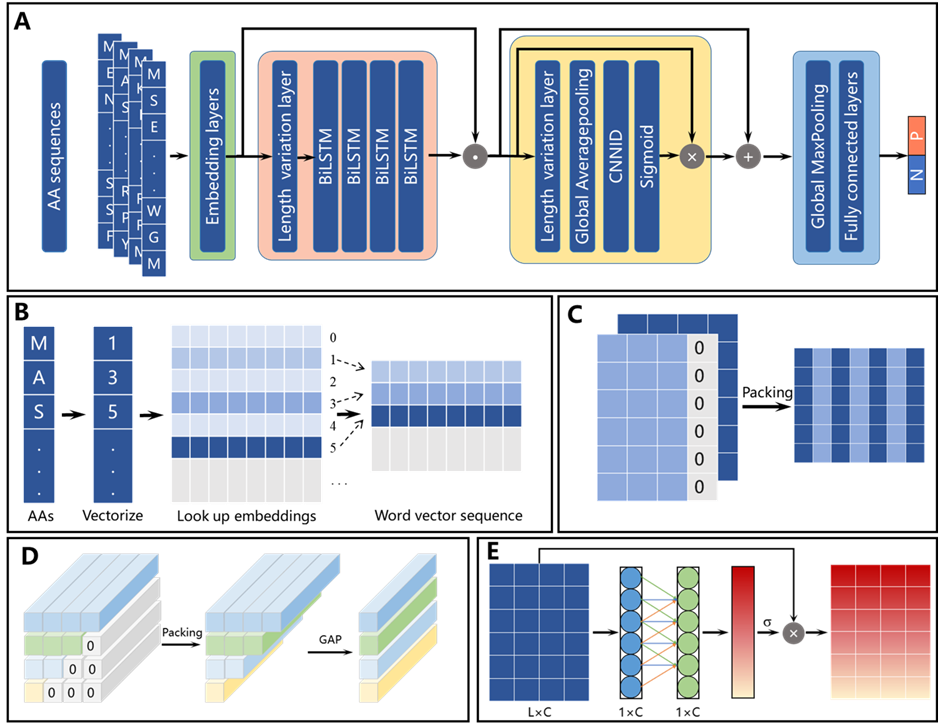

# LRECA

Source codes and a demo for testing our LRECA model for discerning phase-separation potential of proteins directly from AA sequences. This demo also examines the explainability of the model by interpreting the predictions to determine the influence of individual AAs and their sequential patterns on biomolecular condensation regulation. Companion code to the paper "Discovery of phase separation protein with single amino acid attributions by unbiased deep-learning".

## Requirement

This code was implemented using the Pytorch framework (version 2.1.1). More details have been described in the file “requirements.txt”. 

## Files

The folder /RCNN_model contains four files, RCNN_ECA_3_LLPS.py, RCNN_ECA_3_R.py, RCNN_ECA_3_high.py, and RCNN_ECA_3_madata.py, which contain the code for training and testing the model using 10-fold cross validation on the datasets of LLPS and PDB, phaspDB_reviewed and PDB, phaspDB_highthroughput and PDB, and inhouse-dataset and PDB, respectively. 

The folder /RCNN_ECA_saliency contains the files for computing the contribution of each AA and AA segment. Specifically, /RCNN_ECA_saliency /saliency_function /method /RCNN_ECA_saliency_gradCAM.py contain the code for obtained the contribution of each AA. /RCNN_ECA_saliency /saliency_function /RCNN_ECA_save_model contain the well trained model and corresponding parameters. The folder /RCNN_ECA_saliency /LCRs_process contain the code for identifying the main contributing AA segments in a protein for LLPS based on the results of the contributions of each AA.

## Model

The architecture of the model is shown in Figure 1. LRECA model consists of four modules, i.e., embedding module, BiLSTMs, ECA module, and classification module. The model receives an input tensor with dimension (N, M), and returns an output tensor with dimension (N, 2), for which N is the batch size and M is the length of AA sequence. Output of the model: shape = (N, 2). The output contains two probabilities of LLPS and non-LLPS, between 0 and 1, and sum to 1.

  

__Figure 1. Architecture of the Length-variable Recurrent Efficient Channel Attention (LRECA) model.__

 **(A)** Schematic diagram of the model architecture. “.” denotes the concatenation of the two outputs; “×” signifies the multiplication of the two outputs; “+” represents the connection of the two outputs with a residual mode. **(B)** Workflow of the embedding layer. **(C)** Workflow of the data compression process in handling different feature lengths before inputting to the BiLSTM. **(D)** Workflow of the variable length global average pooling. GAP: global average pooling. **(E)** Schematic diagram of the ECANet.


__Individual AA contribution analysis__

Gradient-weighted Class Activation Mapping (Grad-CAM) was used to analysis the contribution of each AA or AA segment in a protein for LLPS, as shown in Figure 2.

  

**Figure 2. Schematic illustration of the Grad-CAM based model explainability method**. N: negative; P: positive.

## Test_Dataset

./processed_dataset contains processed data of three public datasets that are used in this paper, including LLPS, phaspDB_reviewed, phasepDB_highthroughput. 

You can also visit our [website](http://www.ai-phasepro.pro/) for the whole datasets

## Results

The results of classification are stored in the folder ./results/classification, including protein score, acc, sen, spe and auc.

The results of saliency are stored in the folder ./results/output.

Installation guide for running Demo


## Run Demo

### Install Requirement

Code run with python=3.8&torch=2.1.1+cu118

~~~python
conda --name protein --file requirements.txt
conda activate protein
cd Demo
~~~

### To test our model

~~~python
python test/test/RCNN_ECA_3_mydata_test.py
~~~

### Run with other datasets

```python
python test/test/RCNN_ECA_3_LLPS_test.py 
python test/test/RCNN_ECA_3_high_test.py 
python test/test/RCNN_ECA_3_R_test.py 
```

### Saliency

__save LRECA model__

```python
python RCNN_ECA_saliency/saliency_function/RCNN_ECA_save_model.py
```

__Get protein score__

```python
python RCNN_ECA_saliency/saliency_function/method/RCNN_ECA_saliency_gradCAM.py
```

__LCRs split__

```python
python RCNN_ECA_saliency/saliency_function/verify/RCNN_ECA_saliency_verify_gradCAM.py 
python RCNN_ECA_saliency/saliency_function/statics/RCNN_ECA_statics2_FUS_test.py 
python RCNN_ECA_saliency/LCRs_process/split_LCRs_segment_FUS_test.py 
python RCNN_ECA_saliency/saliency_function/statics/RCNN_ECA_statics2_FUS_train.py 
python RCNN_ECA_saliency/LCRs_process/split_LCRs_segment_FUS_train.py 
```

## License

The use of these publicly available datasets must comply with the provisions of these public data sets. This code is to be used only for educational and research purposes. Any commercial use, including the distribution, sale, lease, license, or other transfer of the code to a third party, is prohibited.
